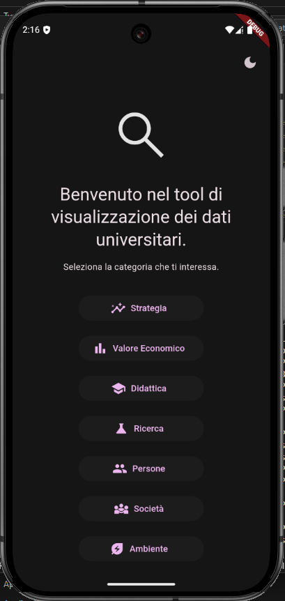
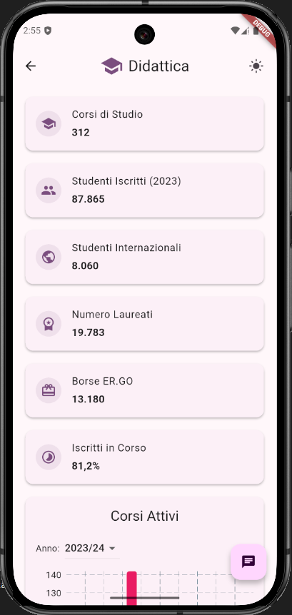
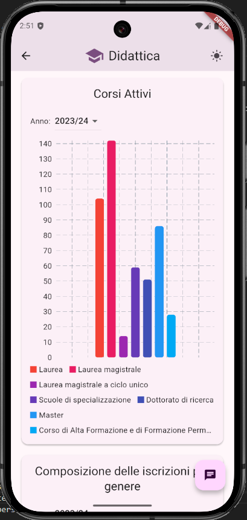
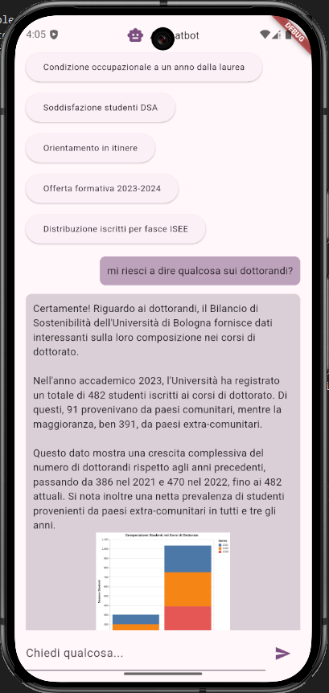

# EcoInsights

**EcoInsights** is a full-stack application for exploring and visualizing sustainability metrics from Unibo’s 2024 sustainability balance. It includes backend APIs and a Flutter-based frontend.

The application allows users to navigate through chapters corresponding to the source of the data. Each chapter page contains summary statistics and graphs.

Additionally, the application features a chatbot powered by Gemini 2. Each page has its own contextual chatbot that can explain topics, provide insights, and generate relevant charts where applicable.

> **Note:** This application requires both **Docker** and the **Flutter SDK** to run.

## Setup & Run

### Backend

1. Navigate to the backend folder:

```bash
cd backend
```

2. Create a `.env` file in the backend folder with your Gemini API key. You can use the provided `.env.example` as a template:

```env
GEMINI_API_KEY="your_api_key_here"
```

3. Start the backend services:

```bash
docker compose up
```

### Frontend

1. Open a separate terminal and navigate to the Flutter frontend folder:

```bash
cd frontend/insightviewer
```

2. Run the app:

```bash
flutter run
```

> The Flutter app is multiplatform and connects to the backend APIs.

---

## Screenshots

### Home Page


### Summary Cards


### Chart Example


### Chatbot Interaction
