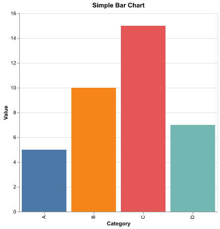

# 📊 Chart API Backend

A lightweight backend service for generating various charts (bar, line, pie, grouped bar, stacked bar) as PNG images using FastAPI, Altair, and VegaLite. The API accepts JSON requests describing the chart parameters and returns rendered PNG images.

---

## ✨ Features

- Supports multiple chart types: Bar, Line, Pie, Grouped Bar, Stacked Bar 📊
- Generates charts with Altair 🎨
- Easy to run locally or in Docker containers 🐳
- Provides JSON schema for request validation 📄

---

## 🛠️ Requirements

- Python 3.13+ 🐍
- Docker (optional, for containerized deployment) 🐳

---

## 🚀 Installation

### Install dependencies (recommended to use a virtual environment)

If running the backend locally, create and activate a virtual environment, then install the required packages:

```bash
python -m venv venv
source venv/bin/activate  # On Windows: venv\Scripts\activate
pip install -r requirements.txt
```

---

## 🏃 Usage

### Running locally

From the `app` directory:

```bash
uvicorn main:app --host 127.0.0.1 --port 8000
```

The service will be available at: `http://127.0.0.1:8000`

---

### Running with Docker

Build the image:

```bash
docker build -t chart-api .
```

Run the container:

```bash
docker run -p 8000:8000 chart-api
```

---

## 📡 API Endpoints

### POST `/chart`

Generate a chart based on the JSON payload.

**Request body:**

```json
{
  "type": "bar",
  "x": ["A", "B", "C", "D"],
  "y": [5, 10, 15, 7],
  "title": "Simple Bar Chart",
  "x_label": "Category",
  "y_label": "Value"
}
```

**Response:**



### GET `/schema/chart_request`

Retrieve the JSON schema for the `ChartRequest` model used for validation.

---

## 📝 Example `curl` Requests

Refer to the included [`curl-examples.md`](curl-examples.md) for detailed example commands with sample outputs.

---

## 📁 Project Structure

```
.
├── app
│   ├── charts.py          # Chart generation logic
│   ├── main.py            # FastAPI app and endpoints
│   └── models.py          # Pydantic data models
├── curl-examples.md       # Example curl commands and sample images
├── Dockerfile             # Docker build configuration
├── requirements.txt       # Python dependencies
└── README.md              # This file
```

---

## 💡 Notes

- The API expects requests with matching lengths for `x`, `y`, and optionally `group` fields.
- Pie chart `y` values can be raw numbers or percentages [0.0 - 1.0] (set via `values_are_percentages`).
- The service returns appropriate HTTP error codes and messages on validation or internal errors.
- Docker container runs the app with Uvicorn server, listening on port 8000.

---

## 📜 License

MIT License
