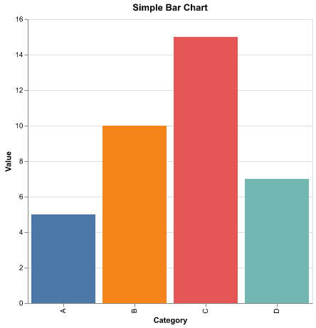
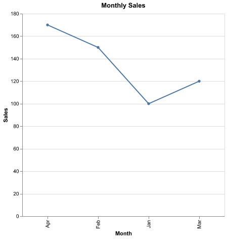
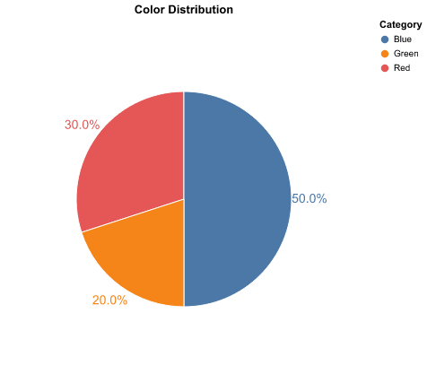
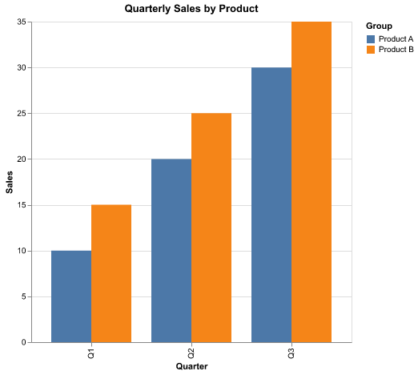
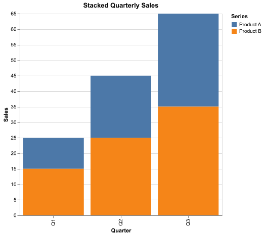

# curl Examples for Chart API

This file contains example `curl` commands to test the `/chart` endpoint of the API.  
Each example sends a JSON payload describing a chart request and saves the resulting PNG image.

## 1. Bar Chart

```bash
curl -X POST http://localhost:8000/chart \
  -H "Content-Type: application/json" \
  -d '{
    "type": "bar",
    "x": ["A", "B", "C", "D"],
    "y": [5, 10, 15, 7],
    "title": "Simple Bar Chart",
    "x_label": "Category",
    "y_label": "Value"
  }' --output bar_chart.png
```


## 2. Line Chart

```bash
curl -X POST http://localhost:8000/chart \
  -H "Content-Type: application/json" \
  -d '{
    "type": "line",
    "x": ["Jan", "Feb", "Mar", "Apr"],
    "y": [100, 150, 120, 170],
    "title": "Monthly Sales",
    "x_label": "Month",
    "y_label": "Sales"
  }' --output line_chart.png
```


## 3. Pie Chart

```bash
curl -X POST http://localhost:8000/chart \
  -H "Content-Type: application/json" \
  -d '{
    "type": "pie",
    "x": ["Red", "Blue", "Green"],
    "y": [30, 50, 20],
    "title": "Color Distribution",
    "values_are_percentages": false
  }' --output pie_chart.png
```


## 4. Grouped Bar Chart

```bash
curl -X POST http://localhost:8000/chart \
  -H "Content-Type: application/json" \
  -d '{
    "type": "grouped_bar",
    "x": ["Q1", "Q1", "Q2", "Q2", "Q3", "Q3"],
    "y": [10, 15, 20, 25, 30, 35],
    "group": ["Product A", "Product B", "Product A", "Product B", "Product A", "Product B"],
    "title": "Quarterly Sales by Product",
    "x_label": "Quarter",
    "y_label": "Sales"
  }' --output grouped_bar_chart.png
```


## 5. Stacked Bar Chart

```bash
curl -X POST http://localhost:8000/chart \
  -H "Content-Type: application/json" \
  -d '{
    "type": "stacked_bar",
    "x": ["Q1", "Q1", "Q2", "Q2", "Q3", "Q3"],
    "y": [10, 15, 20, 25, 30, 35],
    "group": ["Product A", "Product B", "Product A", "Product B", "Product A", "Product B"],
    "title": "Stacked Quarterly Sales",
    "x_label": "Quarter",
    "y_label": "Sales"
  }' --output stacked_bar_chart.png
```
